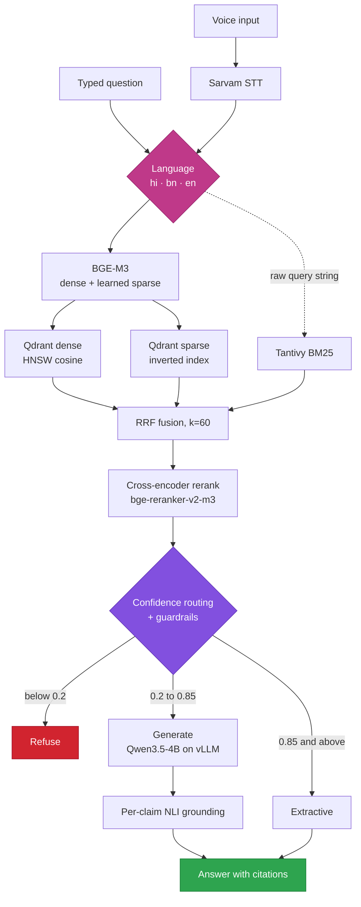
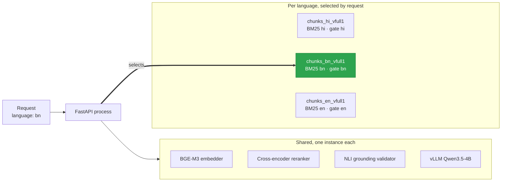
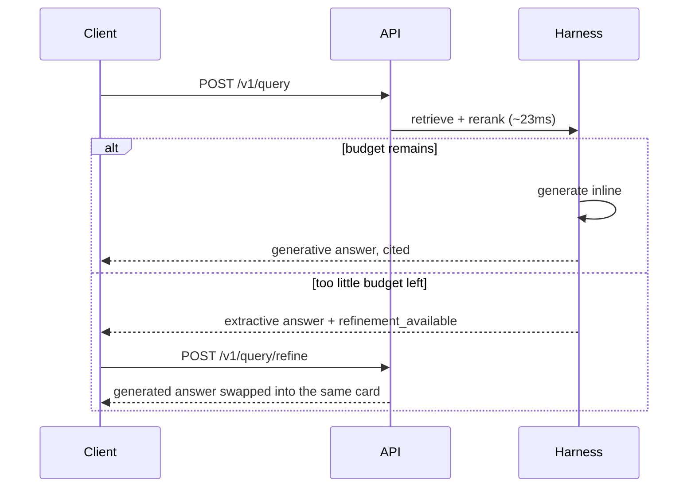

<div align="center">

# ClearAsk

**Voice-enabled RAG over MSMARCO-XI**

Ask in Hindi, Bengali, or English. Typed or spoken. Answered from cited evidence, or refused.

<p>
  
  
  
  
</p>

<p>
  
  
  
  
  
  
  
</p>


<sub>

**[Requirements](#requirements-at-a-glance)** · **[Tech stack](#tech-stack)** · **[Architecture](#architecture)** · **[Languages](#multi-language-serving)** · **[Latency](#4-latency)** · **[API](#api)** · **[Deployment](#deployment)** · **[Limitations](#known-limitations)**

</sub>

</div>

<br>

Submission for **HH Goa 2026 Shortlisting Task 2: Build a Voice-Enabled RAG Model**.

A user asks a question in Hindi, Bengali, or English, typed or spoken. The system transcribes it,
retrieves evidence from [`ai4bharat/MSMARCO-XI`](https://huggingface.co/datasets/ai4bharat/MSMARCO-XI),
and answers with citations to the exact passages supporting each claim. If the evidence isn't
there, it refuses instead. Generation runs on a model served on the same GPU instead of behind an
API, which is why the median request lands at 27ms against a 200ms budget. [Section 4](#4-latency)
reports the tail instead of averaging it away.

<table>
<tr><td><b>GitHub</b></td><td><a href="https://github.com/Ridreb05/rag">github.com/Ridreb05/rag</a></td></tr>
<tr><td><b>Dataset</b></td><td><code>ai4bharat/MSMARCO-XI</code>, Hindi + Bengali + English, <code>validation</code> split</td></tr>
<tr><td><b>Index</b></td><td>Hindi 964,603 chunks, Bengali 958,378 chunks, and English. Version <code>full1</code>, one Qdrant instance with three collections.</td></tr>
<tr><td><b>Deployment</b></td><td>Single RunPod GPU Pod serving all three languages, started on demand. See <a href="#deployment">Deployment</a>.</td></tr>
<tr><td><b>Live API</b></td><td><code>https://&lt;POD-ID&gt;-8000.proxy.runpod.net</code><br>The Pod runs on demand, so this is live during review windows rather than continuously.</td></tr>
</table>

<details>
<summary><b>Full contents</b></summary>

<br>

| | |
|---|---|
| [Requirements at a glance](#requirements-at-a-glance) | Task checklist mapped to evidence |
| [Tech stack](#tech-stack) | Every component and why it was picked |
| [Architecture](#architecture) | End-to-end request flow |
| [Multi-language serving](#multi-language-serving) | How one process serves three languages |
| [1. Speech-to-text](#1-speech-to-text) | Sarvam integration |
| [2. Chunking](#2-chunking) | Per-passage strategy selection |
| [3. Retrieval](#3-retrieval) | Hybrid search, fusion, reranking, quality metrics |
| [4. Latency](#4-latency) | The 200ms budget, measured warm and cold |
| [5. Generation harness](#5-generation-harness) | Routing, deadlines, recovery, grounding |
| [6. Guardrails](#6-guardrails) | Four layers, and the evidence they fire |
| [Two-phase answering](#two-phase-answering) | What happens when generation will not fit |
| [Engineering notes](#engineering-notes) | Profiling deltas and two correctness bugs |
| [Interface](#interface) | The SPA and what the result card shows |
| [API](#api) | Endpoints and response shape |
| [Deployment](#deployment) | Pod topology, volumes, environment knobs |
| [Repository layout](#repository-layout) | Where everything lives |
| [Running locally](#running-locally) | Backend and frontend setup |
| [Reproducing the numbers](#reproducing-the-numbers) | Every benchmark command |
| [Tests](#tests) | Suite layout |
| [Known limitations](#known-limitations) | What this does not do, stated plainly |
| [Acknowledgements](#acknowledgements) | Dataset and model credits |

</details>

---

## Requirements at a glance

<table>
<thead>
<tr><th>#</th><th>Requirement</th><th>Implementation</th><th>Evidence</th></tr>
</thead>
<tbody>
<tr>
  <td align="center"><b>1</b></td>
  <td>Speech-to-text (Sarvam or ElevenLabs)</td>
  <td>Sarvam <code>saarika</code> REST</td>
  <td><a href="#1-speech-to-text">Speech-to-text</a></td>
</tr>
<tr>
  <td align="center"><b>2</b></td>
  <td>Non-naive chunking</td>
  <td>3 strategies + metadata-aware identity</td>
  <td><a href="#2-chunking">Chunking</a></td>
</tr>
<tr>
  <td align="center"><b>3</b></td>
  <td>Under 200ms</td>
  <td><b>P50 26.9ms · P70 31.4ms · P100 183.7ms</b>, 150/150 in budget on a warm index. 138/150 and P100 264.4ms on a cold one. Both reported.</td>
  <td><a href="#4-latency">Latency</a></td>
</tr>
<tr>
  <td align="center"><b>4</b></td>
  <td>P50 / P70 / P100 analytics</td>
  <td>n=150 deployed over HTTPS, twice. n=1000 in-process. Broken out per stage.</td>
  <td><a href="#4-latency">Latency</a></td>
</tr>
<tr>
  <td align="center"><b>5</b></td>
  <td>Proper harness, not a raw prompt call</td>
  <td>Typed orchestrator: routing, deadline, retries, recovery, grounding</td>
  <td><a href="#5-generation-harness">Harness</a></td>
</tr>
<tr>
  <td align="center"><b>6</b></td>
  <td>Guardrails that know when <i>not</i> to answer</td>
  <td>4 layers. <b>16 of 30 generated answers refused</b> on live data.</td>
  <td><a href="#6-guardrails">Guardrails</a></td>
</tr>
</tbody>
</table>

---

## Tech stack

| layer | choice | why this one |
|:---|:---|:---|
| **API** | FastAPI + Pydantic v2, Uvicorn, Python 3.11 | typed request/response contracts the harness also uses internally |
| **Speech-to-text** | Sarvam `saarika:v2.5`, batch REST | the task's "pick one"; batch endpoint covers sub-30s clips |
| **Embeddings** | `BAAI/bge-m3`, 1024-dim dense **and** learned-sparse from one forward pass | two of the three retrieval signals for the cost of one model load |
| **Vector DB** | Qdrant 1.13.4, HNSW cosine + named sparse vectors | one store serving both vector signals; sparse uses the server's inverted index |
| **Lexical search** | Tantivy BM25, embedded | model-independent signal; catches IDs, numbers, proper nouns |
| **Fusion** | Reciprocal Rank Fusion, `k=60` | rank-only, so three incompatible score scales need no calibration |
| **Reranking** | `BAAI/bge-reranker-v2-m3` cross-encoder | its top score is also the routing signal for the harness |
| **Generation** | `Qwen/Qwen3.5-4B` on vLLM, FP8, CUDA graphs, same GPU | no network hop, the single largest latency decision |
| **Grounding check** | `MoritzLaurer/mDeBERTa-v3-base-mnli-xnli` | per-claim entailment against cited evidence, multilingual |
| **Frontend** | React 18, TypeScript 5.7, Vite 6, Tailwind, TanStack Query, Radix, Framer Motion | `MediaRecorder` capture; Noto fonts for all 14 Indic scripts |
| **Packaging** | `uv` (locked), Docker, RunPod GPU Pod on a network volume | vLLM lives in its own venv, see [Deployment](#deployment) |
| **Testing** | pytest, with slow GPU/provider tests opt-in | fast default suite; real-model tests behind a marker |

Runtime topology is one container, three processes: Qdrant on localhost, `vllm serve`, and the API.

---

## Architecture



`POST /v1/query` (text) and `POST /v1/voice-query` (audio) run the same path. Voice adds a
transcription step in front. Generation is served by a local vLLM process on the same GPU as
retrieval. See [Generation backend](#generation-backend) for the measurements behind that choice,
which removed roughly two seconds of network round trip per generated answer.

BM25 starts before the encoder rather than after it, because it needs only the raw query string.
That takes it off the critical path: its cost runs underneath the GPU embedding call instead of
adding to it.

---

## Multi-language serving

One process, one Qdrant instance, one URL. Hindi, Bengali, and English are served side by side.



Every request carries a `language` field. That field selects the Qdrant collection, the BM25
index, and the off-topic gate the request is answered from. Three dicts hold this
(`services.collections`, `services.bm25_indexes`, `services.off_topic_gates`), built once at
startup and looked up per request. A request for an unconfigured language is rejected before any
retrieval work runs, instead of being silently answered from the wrong corpus.

**The GPU models are not duplicated per language.** `BAAI/bge-m3`, the reranker, the NLI grounding
validator, and the vLLM generator are already multilingual, so each stays a single shared instance
across all three languages. Only the data side (collection, BM25 index, corpus centroid) changes
per request. `GenerationHarness.answer()` takes its off-topic gate as a per-call argument for this
reason: one harness instance serves three languages, each with its own gate.

**English has no native split in the dataset.** MSMARCO-XI ships 14 translated languages, and
English is not one of them. It exists only as a source-text field (`English_passages`) inside
every other language's file, sitting next to that language's translation. `build_corpus.py` treats
`en` as a pseudo-language: it reads that field out of one real language's file (Hindi's, here)
instead of the translation. Every other stage of the pipeline treats it as an ordinary language.

### Configuration

| variable | effect |
|:---|:---|
| `VOICE_RAG_LANGUAGES` | Comma-separated languages this process serves, for example `hi,bn,en`. |
| `VOICE_RAG_BOOTSTRAP_LANGUAGES` | Comma-separated languages to build on pod boot. Each one bootstraps in turn: corpus download, chunking, embed, upsert, finalize, all against the one running Qdrant server. The same per-language state manifest and bootstrap lock make a restart a no-op for languages that are already complete. Once every listed language finishes, the pod serves all of them without a second restart. |
| `VOICE_RAG_HEALTH_REQUIRE_ALL_LANGUAGES` | Default `1`. `/v1/health` reports ready only when every configured language is ready. Set to `0` to let the pod serve whichever languages are already built while another is still bootstrapping. |

### Corpus scale

Indexed in full, on one Qdrant instance.

| language | unique passages | chunks | collection |
|:---|---:|---:|:---|
| Hindi | 953,388 | 964,603 | `chunks_hi_vfull1` |
| Bengali | 954,792 | 958,378 | `chunks_bn_vfull1` |
| English | sourced from Hindi's file, see above | | `chunks_en_vfull1` |

Bengali's split has 97,941 queries and 977,545 passage occurrences, a dedup ratio of 0.977.
Embedding ran at roughly 205 chunks per second on the deployment's RTX 4090. `/v1/health` reports
one `qdrant_collection`/`bm25`/`index_complete`/`ready` block per language. Six of the 119 passing
tests are direct regression coverage for per-language routing: one proves a shared harness
instance applies the right language's off-topic gate per call, and others prove retrieval reaches
the requested language's own BM25 index and Qdrant collection.

> [!WARNING]
> **GPU compatibility.** This deployment's pinned `torch==2.6.0+cu118` targets
> `sm_50/60/70/75/80/86/90`. Blackwell GPUs such as the RTX 5090 (`sm_120`) are not compatible with
> it and fail during embedding. RTX 4090 (Ada) is the proven GPU for this image, the same hardware
> [section 4](#4-latency)'s latency numbers were measured on.

---

## 1. Speech-to-text

**Sarvam** (`saarika` STT REST API). One provider, per the task's "pick one."

Implemented as a direct REST client (`pipeline/stt/sarvam_client.py`) against the batch endpoint
(files under 30s), rather than the streaming WebSocket variant. The browser records with
`MediaRecorder` and submits. There is no live streaming transcription.

STT latency is reported as `stt_ms`, separately from the 200ms budget. See
[what the budget covers](#what-the-200ms-covers).

---

## 2. Chunking

`pipeline/chunking/chunker.py` selects a strategy per passage rather than applying one fixed rule:

1. **Whole-passage (no split).** MSMARCO-XI passages are pre-segmented and already retrieval-sized
   (median 55 words, p90 91, p99 139). Splitting them would fragment context for no retrieval gain.
2. **Sentence-aware packing.** For passages over the 512-token budget: greedily packs whole
   sentences into ~256-token windows with 64-token overlap, so a boundary never lands mid-sentence.
   Overlap carries trailing sentences into the next window.
3. **Fixed-token-window fallback.** When no usable sentence boundary exists, or a single sentence
   exceeds the window. Plain overlapping word windows.
4. **Metadata-aware identity.** Every chunk carries `passage_id`, `language`, `chunk_index`,
   `token_count`, and the strategy that produced it, plus a `level`/`parent_id` hook for
   hierarchical chunking.

Chunk-length accounting uses a whitespace token counter, deliberately decoupled from the embedding
model's tokenizer to keep `transformers` out of the chunker. It is an approximation validated
against corpus samples, not an exact token count.

**What the strategies actually did**, across all 964,603 indexed Hindi chunks:

| strategy | chunks | share |
|:---|---:|---:|
| `whole_passage` | 951,816 | 98.7% |
| `fixed_token_fallback` | 6,606 | 0.7% |
| `sentence_aware` | 6,181 | 0.6% |

953,388 passages produced 964,603 chunks, so **1.012 chunks per passage**, median chunk 56 tokens
(p90 94, p99 246, max 512).

> [!NOTE]
> **Chunking is a no-op 98.7% of the time on this dataset, and that is the correct outcome.**
> MSMARCO-XI ships pre-segmented passages, and splitting a 56-token passage hurts retrieval. The
> splitting strategies exist for the 1.3% that genuinely exceed the budget, and which passages
> those are is decided per passage from measured token counts. Pointed at long-form documents, the
> same code splits the majority instead. That is what the `level`/`parent_id` hook is reserved for,
> inert here because this dataset has no document structure.

---

## 3. Retrieval

Three independent signals run concurrently and are fused:

| signal | what it catches |
|:---|:---|
| **Dense.** BGE-M3 1024-dim, Qdrant cosine ANN | semantic similarity |
| **Sparse (learned).** BGE-M3 lexical weights, Qdrant named sparse vector | learned term importance |
| **Sparse (lexical).** Tantivy BM25, embedded | exact IDs, numbers, proper nouns that embeddings under-weight |

Fused with **Reciprocal Rank Fusion** (`k=60`), chosen over weighted score fusion because dense
cosine, learned-sparse and BM25 scores live on incompatible scales. RRF needs only rank order, so
no per-language calibration is required. The top 8 fused candidates are reranked by a BGE
cross-encoder (`bge-reranker-v2-m3`) before the harness sees them.

BM25 also acts as a resilience layer. It is model-independent, so it keeps working if the embedding
service degrades.

### Retrieval quality

Scored against the dataset's own `is_selected` qrels with `evaluation/run_subset_eval.py`, which
indexes exactly the passages a query sample references and runs the real hybrid search over them.
n=120 sampled Hindi validation queries, of which 47 have no relevant passage labelled and are
excluded, leaving 73 scored.

<div align="center">

| metric | fused (dense + learned-sparse + BM25, RRF) |
|:---|---:|
| Recall@10 | **0.890** |
| MRR | **0.479** |
| NDCG@10 | **0.575** |
| HitRate@5 | **0.712** |

</div>

> [!IMPORTANT]
> **This is a closed-world subset, not the 964,603-chunk index.** Only the passages those queries
> reference are indexed, so there are far fewer distractors than production has and Recall@10 is
> correspondingly optimistic. What it does establish is that the fusion path retrieves the labelled
> passage for the large majority of queries, and that the ranking is imperfect enough for reranking
> to have something to do. MRR 0.479 means the right passage is often not first.

The reranked ordering is not scored here: loading the cross-encoder alongside BGE-M3 exhausted
memory on the machine available for this run. `--rerank` scores both orderings side by side on a
host with the headroom.

---

## 4. Latency

### Deployed measurement (primary), n=150

Real HTTPS requests to `POST /v1/query` on the deployed GPU Pod, full 964,603-chunk index, RTX
4090, with the API's own 20 req/60s rate limiter left enabled. The figure is the server's own
`pipeline_ms`. Reproduce with `benchmark/deployed_benchmark.py`.

The run was done twice with the same seed and the same 150 queries, and the two disagree enough
that reporting only one would be cherry-picking:

<div align="center">

| run | P50 | P70 | P95 | P99 | P100 | in budget |
|:---|---:|---:|---:|---:|---:|---:|
| **Warm index** | **26.9** | **31.4** | 171.3 | 179.6 | **183.7** | **150/150** |
| Cold index | 55.1 | 71.3 | 207.9 | 227.9 | 264.4 | 138/150 |

</div>

Raw output: `hi_full1_deployed_inline.json` and `hi_full1_deployed_inline_cold.json` under
`reports/latency_benchmark/`.

The difference is almost entirely one stage:

| stage | P50 warm | P50 cold | P100 warm | P100 cold |
|:---|---:|---:|---:|---:|
| embedding | 6.4 | 6.3 | 15.7 | 15.6 |
| **retrieval (dense + sparse + BM25)** | **4.9** | **32.6** | **26.5** | **139.5** |
| BM25 wall (overlapped) | 0.02 | 0.02 | 0.04 | 0.03 |
| fusion | 0.01 | 0.01 | 0.02 | 0.03 |
| rerank | 11.5 | 11.6 | 25.2 | 26.3 |
| generation | 0.06 | 0.06 | 144.9 | 213.0 |

Embedding and reranking are identical across the two. They are fixed GPU work on a resident model.
Retrieval moved 6.7x at P50 and 5.3x at P100. The cold run was the first sustained traffic after
the Pod started. Roughly 200 queries later, the warm run searched the same index. The likely cause
is OS page cache and Qdrant's own warm state over a 964,603-point index, though this was not
isolated with a controlled cache drop, so it is the best-supported explanation rather than a proven
one.

> [!IMPORTANT]
> **Which number counts depends on what is being claimed.** A Pod serving continuous traffic sits
> in the warm state, and there the deployment meets the budget on every one of 150 requests. A Pod
> started on demand and hit immediately does not: 12 requests missed, worst case 264.4ms. Since
> this deployment is explicitly on-demand, both are real operating conditions.

Generation's P50 of 0.06ms is not a fast model. It is the requests where the model was never
called, because the harness routed straight to an extractive answer or a pre-generation refusal.
In the warm run, 30 of 150 requests reached the model and the per-request records confirm that not
one of them exceeded the budget.

The cold run's 12 misses are attributed to its 26 generative requests by inference rather than by
record, because that run predates the per-request array the benchmark now writes. The arithmetic
supports it: without generation, the cold stage tails sum to at most ~181ms even if embedding,
retrieval and rerank all peaked on the same request, whereas adding a 213ms generation call reaches
the 264.4ms observed. A future cold run answers this directly from `requests[].over_budget`.

This supersedes an earlier n=150 run in the same file series
(`reports/latency_benchmark/hi_full1_deployed.json`: P50 55.8, P70 61.2, P100 172.8, 150/150 in
budget), produced when generation was always deferred out of band and so never measured inline.
All three are kept.

The projection previously documented here, that capping output at 14 tokens would put inline
generation around 182 to 188ms, is close to what the warm run measured (P100 183.7ms). It did not
survive the cold run, where a 213ms generation call cannot fit a 200ms budget whatever it is added
to. The deadline is what keeps that bounded: when too little budget remains the harness defers
generation instead of overrunning further, which it did 4 times in the cold run and never in the
warm one.

<details>
<summary><b>Third-party harness cross-check</b></summary>

<br>

`benchmark/aranya/benchmark.py` is an external latency harness, written against a different
service's in-process retriever. It was pointed at this deployment through a shim that keeps its
`search()` interface but issues HTTPS calls (`benchmark/aranya/app/`). Over 50 queries it reported
embed P50 6.3ms, search P50 2.9ms, total P50 27.7ms and P95 75.9ms. An independent harness landing
on the warm run's numbers (P50 26.9ms) to within a millisecond.

Its queries are English questions about FAISS and HNSW against a Hindi corpus, so **all 50 were
refused** and none reached generation. It therefore cross-checks the retrieval path on an
independent harness and says nothing about the generative path. Client-observed wall clock averaged
779ms, of which ~744ms was network and proxy overhead from outside the datacentre. That is the
reason every figure in this section is the server's own `pipeline_ms` rather than a stopwatch at
the caller.

</details>

<details>
<summary><b>In-process cross-check</b></summary>

<br>

`benchmark/latency_benchmark.py` measures the same pipeline in-process against a local Qdrant
server, isolating per-stage cost. RTX 4060 Laptop GPU. n=1000 for the retrieval sub-stage, n=150
for the full window.

| | P50 | P70 | P100 |
|:---|---:|---:|---:|
| **Full window** | 74.1 | 79.0 | 131.5 |
| **Retrieval sub-stage** | 84.9 | 95.2 | 336.4 |

Slower at P50 than the deployment because the 4060 Laptop is a slower GPU. Same code, same index.
Both are reported. The retrieval sub-stage's P100 (336.4ms) is the one figure above target: a rare
query where several stage tails coincide. It is bounded, 623.3ms before the BM25 bound and 457.9ms
before the sparse bound, but not under 200ms. Per-stage P95/P99:
`reports/latency_benchmark/hi_full1.json`.

</details>

### What the 200ms covers

The target is **chunking + vector DB retrieval + through to final output**, stages three and four
of the task's pipeline (`Voice input → Speech-to-text → Chunking/Retrieval → Answer generation`).
Reported per request as `pipeline_ms` and enforced by `VOICE_RAG_REQUEST_BUDGET_SECONDS`.

| stage | in budget | cost |
|:---|:---:|:---|
| Chunking | yes | 0ms per query, amortised into the offline index build |
| Embedding → dense + sparse + BM25 → RRF → rerank | yes | ~23ms at P50 warm, ~50ms cold |
| Guardrails → answer | yes | ~0ms extractive or refused; 141 to 213ms generative |
| Speech-to-text | no, upstream of the window | reported as `stt_ms` |

Chunking costs nothing per query because MSMARCO-XI passages are chunked once at index build. That
follows from the dataset already being passage-sized. It is not a runtime optimisation.

Speech-to-text sits ahead of the measured window, since the target's clause starts at chunking. It
is still reported: `stt_ms` on the response and result card, and `total_ms` (= `pipeline_ms +
stt_ms`) for the full wall-clock cost of a voice query.

---

## 5. Generation harness

`pipeline/generation/harness.py` is a typed orchestrator, not a prompt-in/text-out call:

1. **Safety pre-filter.** A deterministic regex gate runs *before* retrieval, so an unsafe query
   never spends an embedding call, a Qdrant round trip, or a reranker pass.
2. **Deadline-aware routing.** The harness receives what remains of the request budget and will
   not start a generation call it cannot finish, degrading to the top reranked passage and flagging
   `deadline_exceeded_extractive_fallback`. That flag also makes the answer eligible for phase two,
   so the deadline *defers* generation rather than cancelling it.
3. **Confidence-routed answering.** The reranker's top score decides the path:
   - `< 0.2` → **refuse.** Retrieval found no real support.
   - `0.2 – 0.85` → **generate.**
   - `≥ 0.85` → **extractive.** A single passage already answers the question, so the model is
     skipped entirely. Faster, *and* less able to distort what the passage says.
4. **Error recovery.** A backend failure is a guardrail outcome, not a crash. Retries run against
   a wall-clock budget rather than an attempt count, and a failure degrades to the top reranked
   passage rather than a 500, because retrieval already succeeded and that passage is still a
   grounded answer.
5. **Grounding validation.** Each generated claim is re-checked against its cited evidence with a
   multilingual NLI cross-encoder (`MoritzLaurer/mDeBERTa-v3-base-mnli-xnli`), scored per claim
   rather than as one opaque number. Claims below 0.5 entailment, or with no valid citation, are
   dropped, and the answer is rebuilt from survivors only. Never the model's raw prose.

**Translation for readers.** `POST /v1/translate` renders an answer in English on demand, using
the model already resident on the GPU rather than a translation API. No extra credential, no
network hop. It is a separate endpoint for the same reason refinement is: it must never enter the
200ms budget, and nothing calls it unless a reader asks. The frontend exposes it as a toggle on the
answer card. Worth being precise about what it is: a *display* aid. The English text is not
re-grounded against the evidence, and the citations shown alongside still point at the
original-language passages, which remain the record of what was retrieved.

Thresholds are environment-overridable (`VOICE_RAG_LOW_CONFIDENCE_THRESHOLD`,
`VOICE_RAG_EXTRACTIVE_THRESHOLD`, `VOICE_RAG_ENTAILMENT_THRESHOLD`) so routing can be tuned against
a running deployment rather than by rebuilding an image.

### Generation backend

**Qwen3.5-4B served by vLLM on the same GPU as retrieval.** FP8 weights, `temperature=0`, output
capped at 14 tokens, reasoning mode disabled.

The backend is a runtime choice (`VOICE_RAG_GENERATION_BACKEND`), not a hardcoded import. The
harness depends on a `Generator` protocol (`generate(request) -> GeneratedAnswer | None`, plus
`.model`), so adding another provider means writing one class and one branch in
`generation/factory.py`. A hosted-API backend previously occupied that seam and was removed once
local generation worked. It measured ~2.1s median, almost entirely network round trip, which no
tuning fits inside 200ms. Carrying it meant maintaining a path the deployment could never use.

<details>
<summary><b>Choices made specifically for latency, in the order they cost the most</b></summary>

<br>

- **FP8 weights.** Decoding is memory-bandwidth bound: every token reads the whole weight set from
  HBM, so 4B parameters in bf16 move 8GB/token and cap a 4090 (~1008 GB/s) at ~126 tok/s. Against
  a ~144ms generation budget that is under 11 tokens, not a Hindi sentence. FP8 halves bytes per
  token and roughly doubles the ceiling. Ada has native FP8 tensor cores, so this is
  hardware-supported, not emulated.
- **CUDA graphs enabled.** Measured with eager execution: 634ms for 24 tokens, ~40 tok/s against
  that 126 tok/s ceiling. Only ~32% of the hardware, the rest being per-token Python and
  kernel-launch overhead.
- **Only the top 1 to 2 reranked passages** enter the prompt. Fewer context tokens is the largest
  lever on prefill. The trade is recall on questions needing more passages synthesized.
- **No structured-output schema requested.** Grammar-constrained decoding has real per-token cost,
  and such a schema exists to let the model say *which* passage supports a claim. That is already
  known here, since the prompt contains only the chunks that could be cited, so the service returns
  one claim citing every context chunk and lets the NLI validator do the checking it already does.
  This is not a weaker guarantee: the validator scores a claim against a *list* of candidate
  evidence texts and picks the best match, so a model-declared citation was only ever a hint about
  which passage to check, never a substitute for checking.
- **Reasoning mode disabled** (`enable_thinking: false`). A model that reasons before answering can
  spend its entire token budget on tokens the harness never sees as an answer.
- **Persistent server, streaming responses.** The model is loaded once, not per request, and
  streaming means time-to-first-token is measured separately from total completion
  (`vllm_generation_completed` logs both).

</details>

---

## 6. Guardrails

Four layers, ordered cheapest-first:

| layer | catches | needs the model? |
|:---|:---|:---:|
| Unsafe-input pre-filter | self-harm, violence-instruction, CSAE-adjacent patterns | no |
| Confidence-based refusal | retrieval below 0.2, no real support | no |
| Off-topic centroid gate | queries outside the corpus's topic entirely | no |
| Per-claim NLI grounding | claims not entailed by their cited evidence | yes |

**Evidence it works on live data.** In the warm n=150 deployed run, 54 of 150 queries were refused,
and the `guardrail_flags` show which layer did it: 38 by confidence or the off-topic gate before
the model was involved, and **16 after generation, because the NLI check rejected the claims**.
30 queries reached generation in total, so the grounding validator discarded slightly over half of
what the model produced. The cold run gives the same picture at 13 of 26. The system generated,
checked its own output against the retrieved evidence, and declined to show it.

> [!NOTE]
> Moving generation to a self-hosted model removed a layer that a hosted API had provided for free:
> a provider-side trained safety classifier. The input-side filter is now a keyword/regex list with
> no more capable second opinion behind it, which is a real reduction in depth. The answer-side
> guardrails above are what carry the weight.

---

## Two-phase answering

A hosted LLM call and a 200ms budget cannot share one response. Rather than pick between them, the
system answers in two phases.



**Phase one** answers from what retrieval already earned, inside the budget. The budget is carried
through the request as a deadline, not a per-stage timeout, since individually-bounded stages
still produce an unbounded total. Before committing to generation, the harness checks what is
actually left. If a call cannot finish in time, it returns the top reranked passage, already
grounded and cited.

**Phase two** does the work that did not fit. `POST /v1/query/refine` re-runs generation against
the candidates the request already retrieved and reranked, and the UI swaps the synthesized answer
into the same card. It carries no deadline, because nobody is blocked on it.

**With local generation this is a fallback rather than the normal path.** Generation runs inline
when the budget allows. Two-phase engages when a slow query leaves too little. On the warm run that
never happened, 0 of 150 requests deferred. On the cold run it happened 4 times
(`deadline_exceeded_extractive_fallback`), each leaving a refinement available, and phase two then
took a P50 of 552ms and a worst case of 1186ms. That gap between 200ms and 1186ms is the concrete
reason the work is not attempted inside the request.

Two implementation details that matter:

- **Phase two uses its own generator with a longer retry budget.** Measured: a budget sized for a
  waiting caller expired mid-generation and degraded the refinement back into the same extract it
  existed to improve. A budget for a caller who is not waiting is a different number.
- **Pending refinements are TTL'd (5 min) and bounded (256 entries),** because a dict keyed by a
  client-supplied `trace_id` is otherwise a memory leak. It is per-process, so under multiple
  workers a refine can land on a worker that never saw the query. That returns 404 and the client
  keeps the fast answer already on screen. Covered by `tests/test_refinement_store.py`.

---

## Engineering notes

Each change came from per-stage profiling and was verified to leave results unchanged, or verified
to be an improvement where results did change. Figures are before/after deltas from the run that
measured them.

| change | effect |
|:---|:---|
| **Embedding fast path.** `FlagEmbedding.encode()` charges a single query for batch-mode overhead: it re-runs `.to(device)`/`.eval()` over 568M params per call and runs the model *twice* (adaptive batch-size probe, then the real encode). `embed_query` does one tokenize, one forward. Output is bit-identical (max diff `0.0`), which is required, since these vectors query an index the batch path built. | `29.4ms → 12.8ms` |
| **BM25 searcher caching, then off the critical path.** `search()` reloaded the index from disk every call. The searcher is now cached and invalidated on write. BM25 needs only the raw query string, so it starts *before* the encoder and runs underneath it. | `22.0ms → 14.1ms`, then absorbed |
| **BM25's tail bounded.** Tantivy's OR-of-terms cost scales with matched postings length, and high-frequency Hindi function words pushed single queries past 400ms (p50 ~15ms, p100 ~460ms, a ~30x gap). Past a 100ms budget BM25 is dropped for that request. Dense + sparse still answer it. | retrieval P100 `623ms → 303ms` |
| **Qdrant sparse search had the same pathology,** and profiling (rather than assuming BM25 was still the culprit) showed it was the larger contributor: p50 6.5ms, p100 386ms. Bounded to the same 100ms. Dense is left unbounded: it is the only signal guaranteed to return for any query, and HNSW's cost doesn't scale with term frequency. | sparse P100 `386ms → 101ms`<br>retrieval P100 `458ms → 336ms` |
| **The 200ms target became a real deadline** carried through the request, instead of something measured after the fact. | full-window P100 `3434ms → 184ms` with generation inline on a warm index |
| **Two-phase answering** removed the trade-off that deadline created. Meeting the budget by never generating is a poor answer to a task that asks for both. | a fallback rather than the path: 0 deferrals in 150 warm requests, 4 when cold |
| **Generation moved on-GPU.** A hosted API's ~2.1s median is almost entirely network round trip. A model on the same GPU has no such hop. | `3240ms → 634ms` |
| **CUDA graphs + FP8.** Eager execution ran at ~32% of the hardware's bandwidth ceiling. bf16 then capped useful output at under 11 tokens regardless of scheduling. | `634ms → 190ms` @20 tokens |

<details>
<summary><b>Two correctness bugs found while producing this evidence</b></summary>

<br>

- **BM25 was hitting the corpus, but its unique results were silently discarded.** The BM25 index
  stores chunk IDs, not text, and payloads were only collected from dense/sparse Qdrant hits, so a
  BM25-only candidate could never reach reranking. That made the lexical signal able to *reorder*
  results but never *contribute* one. Measured across 150 queries: **93% were discarding a
  BM25-only candidate, and in 9 the discarded chunk was the best available answer.** Fixed by
  fetching those chunks by primary key (Qdrant point IDs are a pure function of `chunk_id`),
  dispatched before reranking so it overlaps GPU work, and skipped when the vector search already
  returned a decisive answer.
- **The off-topic gate was refusing 100% of queries.** `qdrant-client==1.19.0` against
  `qdrant/qdrant:v1.13.4` silently returns all-zero vectors for `with_vectors=` responses (search
  itself is unaffected). The centroid computation was the only path reading vectors back, so it
  built a zero-vector centroid. Fixed by re-embedding sampled chunk text locally. Centroid norm
  verified `0.0 → 1.0`.

</details>

Rejected on evidence: reranker `max_length` tuning (dynamic padding makes it a no-op) and
DF-filtering BM25's high-frequency terms (faster, but changes the top result on 20% of queries).

---

## Interface

The SPA in `frontend/` is served by the same process as the API, so the deployed URL is both. A
language selector (Hindi, Bengali, English, in `frontend/src/languages.ts`) sets which language
every request is tagged with. Sample prompts, placeholder text, and the live-language badge all
switch with it, and the choice is sent on both the typed and the voice path
(`submitText`/`submitVoice`), not just displayed. It records with `MediaRecorder` and posts to
`/v1/voice-query`.

The result card is built to show the reader what the system did, not just its answer: the per-stage
`latency_ms` breakdown against the budget line, `stt_ms` separately when the question was spoken,
every cited chunk with its ID and rerank score, and the mode the harness chose. When a query was
answered extractively because the deadline pre-empted generation, the card says so and swaps in the
phase-two answer when it arrives. An on-demand English toggle calls `/v1/translate` for readers who
do not read the corpus's language, leaving the cited passages in the original.

---

## API

| method | path | purpose |
|:---|:---|:---|
| `POST` | `/v1/query` | Text question to grounded answer. Rate limited, 20 req/60s per IP. |
| `POST` | `/v1/voice-query` | `multipart/form-data` audio, transcribed, then the same path. |
| `POST` | `/v1/query/refine` | Phase two: regenerate against the candidates already retrieved, by `trace_id`. No deadline. |
| `POST` | `/v1/translate` | Render an answer in English, on the resident model. Display aid only. |
| `GET` | `/v1/health` | Readiness per configured language: manifest and Qdrant point count must agree for each. Also reports the generation backend and its reachability. |
| `POST` | `/v1/admin/export-index/*` | Start, poll, or download an index export, for seeding a new volume. |

```bash
curl -X POST https://<pod>.proxy.runpod.net/v1/query \
  -H 'content-type: application/json' \
  -d '{"query": "ताज महल कहाँ है?", "language": "hi", "top_k": 10}'
```

`language` is `hi`, `bn`, or `en` on this deployment. It selects which collection, BM25 index, and
off-topic gate the request hits (see [Multi-language serving](#multi-language-serving)). It is not
just a label on the response. An unconfigured language gets a 400 instead of a silent answer from
the wrong corpus.

Every response carries `trace_id`, `answer_text`, `mode` (`extractive` | `generative` | `refused`),
`confidence`, `guardrail_flags`, `evidence[]` with the chunk IDs and text behind the answer, and
`latency_ms` broken out per stage, the same `pipeline_ms` the benchmarks report. Interactive
OpenAPI docs are at `/docs`.

---

## Deployment

A single deployment: a **RunPod GPU Pod** running the full index and the local model, started when
needed rather than continuously. `infrastructure/runpod-entrypoint.sh` runs Qdrant on localhost,
starts `vllm serve`, and then uvicorn on port 8000 behind RunPod's HTTPS proxy. One container,
three processes. The same container serves Hindi, Bengali, and English.

On boot, the entrypoint bootstraps every language listed in `VOICE_RAG_BOOTSTRAP_LANGUAGES` one
after another, against that one Qdrant server. Once every language is built, it serves all of
them. See [Multi-language serving](#multi-language-serving) for the mechanics and the evidence.

It is built to survive stop/start on a persistent network volume, which is what makes an on-demand
Pod practical rather than a 24/7 cost:

- Attach a **network volume at `/workspace`.** Index, model weights and the Hugging Face cache
  live there, so a restart reuses all three instead of re-downloading ~12GB and rebuilding a 9GB
  index.
- `VOICE_RAG_BOOTSTRAP_INDEX=1` is safe to leave on. The builder verifies its state manifest and
  exits quickly once the version is complete. Qdrant storage is isolated per
  `VOICE_RAG_INDEX_VERSION`, so a stale collection cannot start its optimizer and starve a clean
  bootstrap sharing the volume.
- A **bootstrap lock** prevents two Pods on one volume from writing the same BM25 index. Recovery
  from a stale lock after a forced stop is opt-in
  (`VOICE_RAG_RECOVER_STALE_BOOTSTRAP_LOCK=1` for one restart), because clearing it wrongly
  corrupts the index.
- `/v1/health` reports ready only when the state manifest **and** Qdrant's exact point count agree,
  so an interrupted upload cannot appear ready merely because its collection exists. It also
  reports which generation backend is configured and whether it is reachable. A down model server
  degrades every generative-band query to extractive rather than failing, which is otherwise only
  visible as a mode mix that looks wrong.

Required secret: `SARVAM_API_KEY` (voice returns 503 without it). Generation needs no credentials,
because the model is local.

The image builds `vLLM` into its own venv (`/opt/vllm-venv`) on Python 3.12, separate from the
application's venv. Both isolations are load-bearing and were found the hard way: vLLM's wheels
pull a CUDA 12.x torch build that would otherwise upgrade the application's pinned cu118 install,
and flashinfer annotates with `array.array[int]`, which is a syntax error before Python 3.12.

### Environment knobs

All changeable without a rebuild.

| variable | default | effect |
|:---|:---:|:---|
| `VOICE_RAG_REQUEST_BUDGET_SECONDS` | `0.2` | the deadline itself |
| `VOICE_RAG_VLLM_MAX_TOKENS` | `14` | output cap, ~6.5 to 7.5ms per token |
| `VOICE_RAG_VLLM_CONTEXT_CHUNKS` | `2` | passages in the prompt, trades recall for prefill |
| `VOICE_RAG_VLLM_QUANTIZATION` | `fp8` | empty serves bf16 |
| `VOICE_RAG_VLLM_ENFORCE_EAGER` | `0` | `1` disables CUDA graphs if capture exhausts memory |
| `VOICE_RAG_VLLM_GPU_MEM_FRACTION` | `0.55` | vLLM's share of the GPU, alongside the retrieval models |
| `VOICE_RAG_LOW_CONFIDENCE_THRESHOLD` | `0.2` | below this, refuse rather than generate |

`Dockerfile.cloudrun` targets the same full-index architecture on Cloud Run and is unused.

---

## Repository layout

```
src/voice_rag/
  settings.py             # Env-var settings (SARVAM_API_KEY)
  pipeline/
    ingestion/            # MSMARCO-XI schema, HF access, dedup, dataset analysis
    chunking/             # Adaptive chunking strategies
    embeddings/           # BGE-M3 dense + learned-sparse service
    retrieval/            # Qdrant dense/sparse, Tantivy BM25, RRF fusion
    reranking/            # BGE cross-encoder
    guardrails/           # Safety filter, off-topic gate, NLI grounding
    generation/           # vLLM backend, factory, typed schemas, the harness
    stt/                  # Sarvam speech-to-text client
  api/
    main.py               # FastAPI app: lifespan, per-language routing, readiness, SPA mount
    rate_limit.py         # Per-IP sliding-window rate limit (20 req/60s/worker)
scripts/                  # Resumable full-index builder, smoke-index helper
evaluation/
  retrieval_metrics.py    # Recall@K, MRR, NDCG@K, HitRate@K
  run_subset_eval.py      # Closed-world subset eval against the dataset's own qrels
benchmark/
  deployed_benchmark.py   # HTTPS against a live deployment; server-reported pipeline_ms
  latency_benchmark.py    # Same pipeline in-process, per-stage isolation
  voice_e2e_benchmark.py  # /v1/voice-query wall clock, including STT
frontend/
  src/languages.ts        # Hindi/Bengali/English config: labels, prompts, placeholders
infrastructure/
  runpod-entrypoint.sh    # Qdrant + vLLM + per-language bootstrap loop + uvicorn
reports/                  # Benchmark evidence cited above
```

---

## Running locally

```powershell
# Backend
uv sync --frozen
cp .env.example .env   # SARVAM_API_KEY
uv run python -m voice_rag.pipeline.ingestion.build_corpus --languages hi --split validation
uv run python -m voice_rag.pipeline.chunking.build_chunks --languages hi --split validation
uv run python scripts/build_full_index.py --language hi --split validation \
    --qdrant-url http://localhost:6333 --index-version full1
uv run uvicorn voice_rag.api.main:app --port 8000

# Frontend
cd frontend && npm ci && npm run dev   # proxies /v1 to :8000
```

Swap `hi` for `bn` or `en` to build another language into the same local Qdrant, then set
`VOICE_RAG_LANGUAGES=hi,bn,en` before starting the API to serve all of them.

Generation requires a vLLM server on `VOICE_RAG_VLLM_BASE_URL` (default
`http://127.0.0.1:8001/v1`). Without one, the harness degrades to extractive answers rather than
failing. Or `docker compose up` for the two-service (Qdrant + app) topology.

---

## Reproducing the numbers

```powershell
# Latency against a running deployment, the primary figures in section 4
uv run python -m benchmark.deployed_benchmark --api-url https://<pod>.proxy.runpod.net --n-queries 150

# The same pipeline in-process, per-stage
uv run python -m benchmark.latency_benchmark --language hi --index-version benchmark `
    --qdrant-url http://localhost:6333 --n-queries 1000 --n-queries-e2e 150

# Voice path wall clock, including STT
uv run python -m benchmark.voice_e2e_benchmark --audio-dir data/benchmark_audio --api-url <url>

# Retrieval quality against the dataset's own qrels
uv run python -m evaluation.run_subset_eval --language hi --n-queries 300 --rerank
```

`deployed_benchmark.py` paces itself inside the API's 20 req/60s limiter, so a 150-query run takes
about eight minutes, most of it waiting. It samples the same validation queries with the same seed
as the in-process benchmark, so the two are comparable rather than merely similar. Raw JSON lands
in `reports/latency_benchmark/`.

---

## Tests

```powershell
uv run pytest -q      # 119 passed, 6 deselected (slow/GPU/provider), 2026-08-22
uv run pytest -m slow tests/test_ml_integration.py tests/test_sarvam_integration.py
```

The default suite is fast unit/component coverage. Slow tests load real ML models or call paid
providers and are opt-in.

---

## Known limitations

> [!IMPORTANT]
> **The budget holds on a warm index and not on a cold one.** Two n=150 runs over the same queries:
> 150/150 in budget at P100 183.7ms warm, 138/150 at P100 264.4ms cold, the difference being a 6.7x
> swing in Qdrant retrieval time. The deployment is started on demand, so the cold state is a real
> operating condition and not a laboratory artifact. Nothing in the code warms the index on
> startup. A few hundred throwaway queries after boot would, and that is not implemented.

- **The cache explanation is inferred, not isolated.** Embedding and rerank timings were unchanged
  across the two runs and only retrieval moved, which points at page cache and Qdrant warm state,
  but no controlled cache-drop experiment was run to confirm it.
- **Retrieval quality is measured on a closed-world subset, not the full index.** Recall@10 0.890
  is against ~1.2K indexed chunks, not 964,603, so it overstates production recall. Reranked
  ordering is unscored, because the cross-encoder would not co-load with BGE-M3 on the available
  machine.
- **Section 4's latency and retrieval-quality figures are Hindi-only.** Bengali and English are
  indexed and served on the same deployment (see [Multi-language serving](#multi-language-serving)).
  Correctness is covered by tests and a live `/v1/health` check per language, but neither has its
  own n=150 latency run or Recall@10/MRR/NDCG evaluation the way Hindi does. The pipeline is
  identical per language, so the Hindi figures are a reasonable proxy, not a substitute for
  measuring each language directly.
- **Only 14 of 150 benchmark queries produced a generative answer** (30 reached the model, 16 were
  refused after it), so the generative path's latency distribution rests on a small sample even
  though the overall run is n=150.
- **Answer relevance is not checked, groundedness is.** A cross-encoder scores topical relatedness,
  so for a question whose answer is absent from the corpus it can rank a near-miss passage well
  above the refusal threshold. Generation then faithfully summarises it and the NLI validator
  correctly passes it, because the claim genuinely is entailed by the passage cited. The user gets
  a well-grounded answer to a question they did not ask. Raising
  `VOICE_RAG_LOW_CONFIDENCE_THRESHOLD` trades recall against this. A real fix is a query-to-answer
  relevance check, which costs latency the budget does not currently have.
- **Answers inherit the corpus's vintage.** MSMARCO-XI passages have a fixed date, so a correctly
  grounded answer can be outdated. This is by design: the corpus is the authority, and a system
  that "corrects" it from model memory breaks the guarantee that answers trace to cited evidence.
- **14 output tokens is a short Hindi sentence.** Hindi tokenises at roughly 2 to 4 tokens per
  word, so longer answers truncate. `VOICE_RAG_VLLM_MAX_TOKENS` trades latency back for words.
- **Input-side safety lost a layer** when generation moved to a self-hosted model. See
  [Guardrails](#6-guardrails).
- MSMARCO-XI covers 14 languages in total. This deployment serves the 3 with real corpus data
  indexed: Hindi, Bengali, English. Adding another language means setting
  `VOICE_RAG_BOOTSTRAP_LANGUAGES`, not writing code, for any language MSMARCO-XI ships a native
  split for.
- The retrieval sub-stage's P100 (336.4ms in-process) exceeds target on rare queries where several
  stage tails coincide, even with BM25 and sparse individually bounded.
- Latency depends materially on GPU: P50 26.9ms on a 4090 versus 74.1ms on a 4060 Laptop, same code
  and index.
- Over half the generated answers in the deployed run were refused by the grounding check (16 of
  30). That is the guardrail working, but it also indicates retrieval surfaces topically-close
  passages that do not support a specific claim.
- No full `TestClient` coverage of `/v1/query` or `/v1/voice-query`. The refinement store's
  eviction, TTL and single-use rules are unit-tested. Endpoint wiring is verified against the live
  deployment rather than in CI.

---

## Acknowledgements

| | |
|:---|:---|
| **Dataset** | [`ai4bharat/MSMARCO-XI`](https://huggingface.co/datasets/ai4bharat/MSMARCO-XI) by AI4Bharat |
| **Embeddings** | [`BAAI/bge-m3`](https://huggingface.co/BAAI/bge-m3) |
| **Reranker** | [`BAAI/bge-reranker-v2-m3`](https://huggingface.co/BAAI/bge-reranker-v2-m3) |
| **Grounding** | [`MoritzLaurer/mDeBERTa-v3-base-mnli-xnli`](https://huggingface.co/MoritzLaurer/mDeBERTa-v3-base-mnli-xnli) |
| **Generation** | [`Qwen/Qwen3.5-4B`](https://huggingface.co/Qwen/Qwen3.5-4B), served with [vLLM](https://github.com/vllm-project/vllm) |
| **Speech-to-text** | [Sarvam AI](https://www.sarvam.ai/) `saarika:v2.5` |
| **Vector DB** | [Qdrant](https://qdrant.tech/) · **Lexical search** [Tantivy](https://github.com/quickwit-oss/tantivy) |

<div align="center">
<br>
<sub>Built for HH Goa 2026 Shortlisting Task 2.</sub>
</div>
