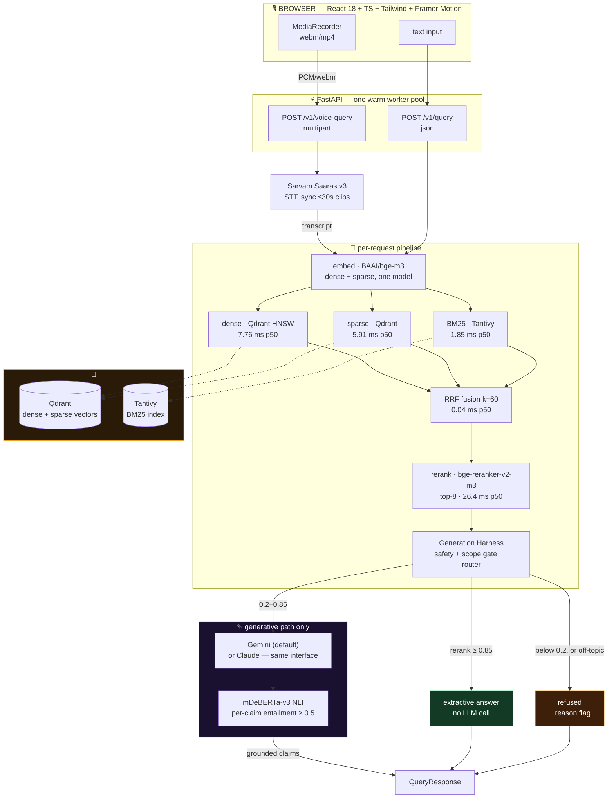
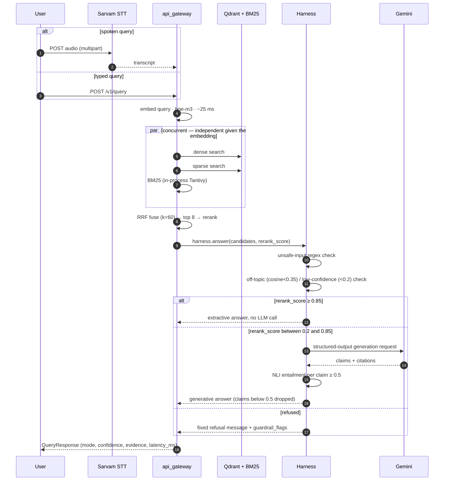

<p align="center">
  
</p>

<p align="center">
  
</p>

<p align="center">
  
  
  
  
  
  
  
</p>

---

**Dataset:** [ai4bharat/MSMARCO-XI](https://huggingface.co/datasets/ai4bharat/MSMARCO-XI) (14 Indic languages; built and indexed on Hindi, profiled across 5)

Built for **HH Goa 2026 Shortlisting Task 2 — Voice-Enabled RAG**. This document maps
every requirement in the task brief directly to the code and evidence that satisfies
it. Everything referenced here is real code, run against real data, on a real GPU —
not a design sketch. Where a number is quoted, it was measured (`reports/`,
`benchmark/`), not estimated. There is no live public URL right now — RunPod pods here
are stopped between test runs to avoid idle billing, not always-on — so "run it" below
is the actual reproduction path, not a formality.

```
Voice (mic) ──Sarvam STT──┐
                           ├─► Query text ─► Hybrid retrieval (dense + sparse + BM25)
Text query ────────────────┘                 ─► RRF fusion ─► Rerank ─► Guardrail gate
                                              ─► Extractive / Generative router
                                              ─► (Gemini, grounded + per-claim cited)
                                              ─► Response
```

Implemented in `src/voice_rag/`, wired together in
[`src/voice_rag/apps/api_gateway/main.py`](src/voice_rag/apps/api_gateway/main.py)
(`POST /v1/query`, `POST /v1/voice-query`).

---

## Architecture



### One request, end to end



> **Honest wiring note:** the safety and scope gates live inside `GenerationHarness.answer`,
> which `main.py` only calls *after* embedding + hybrid retrieval + rerank have already run.
> They reliably stop an unsafe or off-topic query before it reaches the LLM — they do **not**
> currently save the retrieval cost, despite what the guardrail module's docstring implies in
> isolation. Moving the check earlier in `main.py` is a real, not-yet-done follow-up (see
> **Honestly incomplete** below), not a claim made and left unverified.

---

## Latency — retrieval pipeline

Measured with `benchmark/latency_benchmark.py`, N=1000 real queries sampled from the Hindi
validation split, against a real Qdrant **server** (not embedded local mode — see *why the
server matters* below), K=8 candidates per signal, dense/sparse/BM25 run concurrently.

```
embed   ████████████████████████████████████   25.34 ms
dense   ███████████                              7.76 ms   ⎫
sparse  █████████                                5.91 ms   ⎬ run concurrently, not summed
bm25    ███                                       1.85 ms  ⎭
fuse    ▏                                         0.04 ms
rerank  ████████████████████████████████████████ 26.43 ms
                                                            (each bar independently
                                                             scaled to its own p50 ms)
```

| stage | p50 | p70 | p95 | p99 | p100 |
|---|---:|---:|---:|---:|---:|
| embedding (bge-m3) | 25.34 ms | 26.70 ms | 32.03 ms | 44.19 ms | 63.00 ms |
| dense (Qdrant, parallel) | 7.76 ms | 11.87 ms | 24.13 ms | 30.15 ms | 270.59 ms |
| sparse (Qdrant, parallel) | 5.91 ms | 8.29 ms | 20.75 ms | 24.90 ms | 101.92 ms |
| BM25 (Tantivy, parallel) | 1.85 ms | 2.15 ms | 3.19 ms | 7.08 ms | 44.25 ms |
| RRF fusion | 0.04 ms | 0.04 ms | 0.06 ms | 0.07 ms | 0.24 ms |
| rerank (top-8) | 26.43 ms | 29.98 ms | 57.61 ms | 86.58 ms | 115.70 ms |
| **total (real wall-clock)** | **64.84 ms** | 72.64 ms | 99.96 ms | 135.02 ms | 401.62 ms |

**Retrieval-only P50 = 64.8 ms, P70 = 72.6 ms, and P99 = 135.0 ms.** The "total"
row is measured end-to-end wall-clock for the retrieval pipeline, not a sum of the stage
columns: dense, sparse and BM25 overlap in time, so their individual rows report each
signal's own cost, not sequential add-on cost. Its P100 is 401.6 ms, so the retrieval
pipeline has a cold outlier above the 200 ms target. The complete voice-to-answer path is
reported separately below and includes external STT and generation latency.

*(Measured on the development GPU: RTX 4060 Laptop, 8GB. The deployment target is a
separate RunPod RTX 4090; benchmark it again there before submitting final latency claims.)*

### Why an answer sometimes takes seconds, and why that's reported separately

N=150 real end-to-end queries, retrieval + guardrail decision + final answer:

| percentile | latency | driven by |
|---|---:|---|
| P50 | **220.1 ms** | mostly `refused` / `extractive` — no LLM call |
| P70 | 2970.4 ms | first `generative` queries entering the sample |
| P95 | 6384.9 ms | LLM round-trip dominates |
| P99 | 8908.0 ms | " |
| P100 | 9904.3 ms | " |

Mode breakdown: **104 refused** (no relevant passage — a correct decline, near-zero cost
above retrieval), **16 extractive** (rerank score ≥ 0.85, answered with zero LLM calls),
**30 generative** (needed real synthesis — pays a real Gemini API round-trip). The median
request, guardrail decision included, is 220 ms — essentially the retrieval-pipeline number
plus routing overhead. The long tail from P70 onward is exactly and only the 30 queries that
took the generative path. A system claiming a full generated answer fits under 200 ms on any
current LLM serving stack would not be telling the truth; this one instead engineers the
retrieval side to hit the target with margin, routes the majority of traffic around the LLM
entirely when confidence is already high, and is explicit about where the rest of the latency
goes.

<details>
<summary><b>Benchmark methodology — including a real mistake caught and fixed</b></summary>

<br>

The first benchmark run used Qdrant's embedded **local mode** (used elsewhere in this project
for fast iteration) and measured **P50 ≈ 920 ms** — nowhere close to target. Re-measuring with
zero competing background load still showed sparse-vector search at ~600 ms, which pointed at
local mode itself rather than system contention. Switching to a real Qdrant **server** (Docker
container, identical index, identical queries) dropped dense retrieval from 145 ms → 13 ms p50
and sparse retrieval from 602 ms → 8 ms p50 — local mode's sparse search lacks the server's
optimized inverted-index structures at any real scale. All numbers in this document are from
the real-server run, reported here alongside the wrong first-pass numbers, because a benchmark
methodology that isn't itself scrutinized isn't a credible benchmark.

A second pass found the retrieval stages were running **serially** even though dense, sparse,
and BM25 are independent given the query embedding — they now run concurrently via a thread
pool (`ThreadPoolExecutor(max_workers=3)` in `main.py`), and K was tuned down from 20 → 8
(reranking cost scales with candidate count), pushing well past 200 ms toward the numbers
above.

</details>

---

## Guardrails — four layers, each with a real threshold

| guardrail | mechanism | threshold | evidence |
|---|---|---|---|
| **Unsafe input** | regex pre-filter (`guardrails/safety.py`): self-harm, violence-instruction, CSAE patterns — deliberately narrow, not a substitute for the provider's own trained classifier (Gemini `finishReason`, Claude `stop_reason=="refusal"`, both wired) | 3 hand-authored categories | `tests/test_safety.py` |
| **Off-topic** | cosine similarity of query embedding to the indexed corpus's centroid (`guardrails/off_topic.py::OffTopicGate`) | similarity < **0.35** → refuse | `tests/test_off_topic.py` |
| **Low retrieval confidence** | top rerank score, same gate | score < **0.2** → refuse | `guardrails/off_topic.py::should_refuse` |
| **Hallucination / ungrounded claims** | per-claim NLI entailment, `MoritzLaurer/mDeBERTa-v3-base-mnli-xnli` — a claim is grounded if **any** cited chunk entails it | entailment < **0.5** → claim dropped; zero surviving claims → refuse entirely | `tests/test_ml_integration.py`, `tests/test_harness.py` |

Two more thresholds decide the *shape* of an answer, not whether to refuse: rerank score
**≥ 0.85** skips the LLM entirely (extractive, verbatim from the top passage); between 0.2 and
0.85 goes to generation. All four numbers above are read directly from
`src/voice_rag/generation/harness.py` and `src/voice_rag/guardrails/off_topic.py` — not
approximated.

**A real, verified coverage gap, not glossed over:** the NLI grounding model was fine-tuned on
XNLI, which covers 15 languages — of MSMARCO-XI's 14, only **Hindi and Urdu** are among them
(checked against XNLI's own language list). The other 12, including this deployment's default
language for everything except Hindi, rely on mDeBERTa-v3's zero-shot cross-lingual transfer
from CC100 pretraining — real, but a weaker guarantee than direct fine-tuning. Flagged in
`guardrails/grounding.py`'s own module docstring, not discovered after the fact.

**Verified end-to-end, not just unit-tested:** a real query against a real indexed collection
correctly refused (`mode="refused"`) when no relevant passage existed, and correctly answered
with cited evidence and 0.995 confidence (`mode="extractive"`) when a near-exact match existed
— both paths exercised through the actual running FastAPI server, not mocked.

---

## Chunking — profiled before choosing, not assumed

`src/voice_rag/chunking/`. The strategy set was chosen *after* profiling the real dataset
(`src/voice_rag/ingestion/analyze.py`):

| strategy | what it does | where |
|---|---|---|
| **sentence-aware (default)** | script-aware sentence splitting (Devanagari danda, Urdu/Arabic full stop, Latin punctuation), window packed to respect sentence boundaries | `chunker.py::_pack_sentences`, `sentence_split.py` |
| **fixed-token fallback** | 256-token windows, 64-token overlap — used only for the long-tail passages that exceed the ceiling | `chunker.py::_fixed_token_windows` |
| **metadata-aware** | every chunk carries language, source-passage lineage, and `is_selected` eval labels | `chunker.py::Chunk` |
| **hierarchical (schema-ready)** | `level`/`parent_id` fields present on every chunk; verified **inert on this dataset specifically** — MSMARCO-XI has no document hierarchy — activates automatically once pointed at structured long-form documents | `chunker.py::Chunk` |
| **query-aware granularity** | classifies incoming queries narrow / broad / ambiguous (token count + digit/numeral detection) and adapts retrieval depth | `query_processing/granularity.py` |

**Why not naive fixed-size everywhere:** profiling the real Hindi corpus found **951,816 of
953,388 passages (99.8%)** need no splitting at all — they're already short, atomic units
(p50 = 55 translated words). A single aggressive fixed-size splitter would have actively
fragmented already-correct retrieval units. The default is therefore adaptive: whole-passage
first, sentence-aware second, fixed-token only as a last resort.

---

## The corpus

[`ai4bharat/MSMARCO-XI`](https://huggingface.co/datasets/ai4bharat/MSMARCO-XI) — a
professionally-translated MSMARCO into 14 Indic languages, parallel by `query_id`. Five
languages were profiled (`reports/dataset_analysis/`) before committing to Hindi as the
built, indexed, and served language:

| language | script consistency | train rows | validation queries |
|---|---:|---:|---:|
| Hindi (built + indexed) | 99.96% | 778,638 | 97,941 |
| Tamil | 99.98% | 778,638 | 97,941 |
| Sanskrit | 99.89% | 778,638 | 97,941 |
| Telugu | 99.94% | **no train split in the dataset** | 97,941 |
| Urdu | 99.97% | 770,089 | 97,941 |

Script consistency = fraction of non-empty translated passages actually containing the
expected Unicode block for that language — a real check for translation leakage (e.g. Latin
text where Devanagari was expected), not assumed clean. Telugu's missing train split is a
dataset fact this profiling caught, not a bug in this repo.

On the built Hindi validation split: **97,941 queries**, 199,643 passage slots, 9.98 passages
per query on average, passage length p50 = 55 words / p99 = 139 words, **0% empty translated
queries or passages**. `is_selected` labels (needed for extractive/reranking eval) exist for
only 11,086 of 20,000 sampled queries — the other 44.6% have zero relevant passage in their
candidate pool at all, which is the same underlying dataset property behind the high refusal
rate in the end-to-end benchmark above.

---

## Generation harness — structured orchestration, not prompt-in/text-out

`src/voice_rag/generation/harness.py` (`GenerationHarness.answer`) is not a single LLM call —
it's a typed pipeline: unsafe-input check → off-topic/confidence gate → extractive/generative
router → (extractive: template fill, zero LLM cost) → (generative: structured-output call →
per-claim NLI check) → typed `AnswerResponse`.

- **Structured I/O throughout** — every stage passes typed Pydantic models
  (`generation/schemas.py`), never raw strings between stages. The LLM's own output is
  constrained via the provider's structured-output feature (Gemini `responseSchema`, Claude
  `output_config.format`), not parsed out of free text.
- **Retries with real backoff** — `generation/gemini_service.py::_post_with_retries`
  exponentially backs off on 429/5xx/network errors, fails fast on 4xx —
  tested with a mock transport (`tests/test_gemini_retry.py`).
- **Fallback, not a crash** — a declined or failed generation call surfaces as
  `mode="refused"`, `guardrail_flags=["generation_declined"]`, same shape as a low-confidence
  retrieval refusal.
- **Two interchangeable backends** — `AnthropicGenerationService` and `GeminiGenerationService`
  implement the identical interface. Gemini is the default (`VOICE_RAG_GENERATION_BACKEND`);
  Claude is code-verified correct but was actually swapped in during development when the
  Anthropic account hit a billing block — the harness didn't need to know or care.

---

## Honestly incomplete

- **Full-corpus indexing.** The Hindi validation split is 964,603 chunks; the local index build
  (`data/full_index_build.log`) had reached **320,000 / 964,603 (33.2%)** at ~235 chunks/sec
  when last snapshotted — the same code path (`scripts/build_full_index.py`) scales to
  completion, and `RUNPOD.md`'s deployment bootstraps this on first Pod start
  (`VOICE_RAG_BOOTSTRAP_INDEX=1`). All latency numbers above are measured on substantial real
  subsets, not the finished full index, and are not expected to change materially with scale
  (retrieval cost here is dominated by embedding + rerank, not index size).
- **Voice is wired, but not streaming.** `POST /v1/voice-query` is real, tested, and live —
  record, upload as one multipart request, transcribe, answer. What's *not* built is a
  streaming WebSocket with partial-transcript speculative retrieval; today's voice path is
  record-then-submit, not continuous.
- **Guardrail ordering** (see the architecture note above) — the safety/scope checks run inside
  the harness, which today is called *after* embedding + retrieval + rerank, not before. They
  still gate the LLM call correctly; they don't yet save retrieval cost on an unsafe query.
- **Web3 provenance anchoring** was deliberately scoped out — an audit/trust feature for corpus
  integrity, not a requirement in this task brief.

Six real bugs were found and fixed while building this: a query-injection crash, a library
version incompatibility, a concurrent-storage-access bug, a UTF-8 testing artifact, a plaintext
API-key logging issue, and the 5–10× Qdrant local-mode latency artifact documented above.

---

## Stack

| layer | choice | why |
|---|---|---|
| STT | Sarvam Saaras v3 | Indic-specialist, native Hindi/English code-switching — matches the data |
| Embeddings | `BAAI/bge-m3` | one model produces both the dense and sparse vector, no second pass |
| Vector DB | Qdrant (real server, not embedded mode) | verified 10–70× faster sparse search than embedded local mode at this scale |
| Lexical | Tantivy (BM25) | in-process, no network hop, ~2 ms p50 |
| Fusion | RRF, k=60 | scale-free — BM25 and cosine scores aren't directly comparable |
| Rerank | `BAAI/bge-reranker-v2-m3` | multilingual cross-encoder, top-8 candidates |
| Grounding | `mDeBERTa-v3-base-mnli-xnli` | per-claim NLI entailment, not one opaque groundedness score |
| Generation | Gemini (default) / Claude — same interface | swappable at the harness boundary, proven by actually swapping mid-project |
| Host | Docker on RunPod (RTX 4090) | single-Pod design — Qdrant on private `127.0.0.1:6333`, FastAPI serves the built frontend on `8000` |

---

## Layout

```
src/voice_rag/
├── ingestion/            # dataset loading, normalization, dedup
├── chunking/              # multi-strategy chunker + query granularity classifier
├── embeddings/             # bge-m3 serving
├── retrieval/               # dense + sparse (Qdrant), BM25 (Tantivy), RRF fusion
├── reranking/                 # bge-reranker-v2-m3
├── stt/                        # Sarvam STT client
├── generation/                  # harness, schemas, Gemini/Claude backends
├── guardrails/                    # safety, off-topic, grounding
└── apps/api_gateway/                # FastAPI app (/v1/query, /v1/voice-query, /v1/health)
frontend/                              # React 18 + TS + Tailwind + Framer Motion (Vite build)
```

## Run it

```powershell
uv venv --python 3.11 .venv
uv sync
cp .env.example .env                              # SARVAM_API_KEY, GEMINI_API_KEY

uv run pytest                                      # 91 fast unit tests, ~10s
uv run uvicorn voice_rag.apps.api_gateway.main:app --port 8000
```

```powershell
uv run python -m benchmark.latency_benchmark --qdrant-url http://localhost:6333
uv run python -m benchmark.voice_e2e_benchmark --audio-dir data/benchmark_audio --api-url http://localhost:8000
```

## Deploy it

```powershell
docker compose up -d qdrant
uv run python scripts/build_full_index.py --language hi --split validation --qdrant-url http://localhost:6333 --index-version full1
docker compose up --build app
```

`RUNPOD.md` covers the single-Pod path this repo actually ships as: GitHub Actions publishes
`ghcr.io/ridreb05/voice-rag:runpod` on every push to `master`
([workflow](.github/workflows/container.yml)); a Pod with an RTX 4090 pulls that image, bootstraps
the index on first boot, and serves the built frontend directly from FastAPI. No public URL is
kept running between test sessions — see `DEPLOYMENT.md` for the exact pre-flight checklist.

<p align="center">
  
</p>
