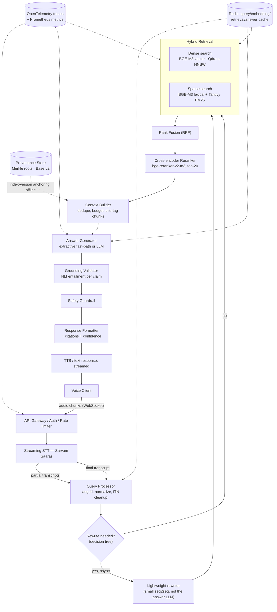
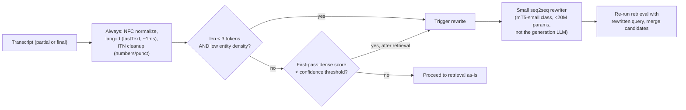
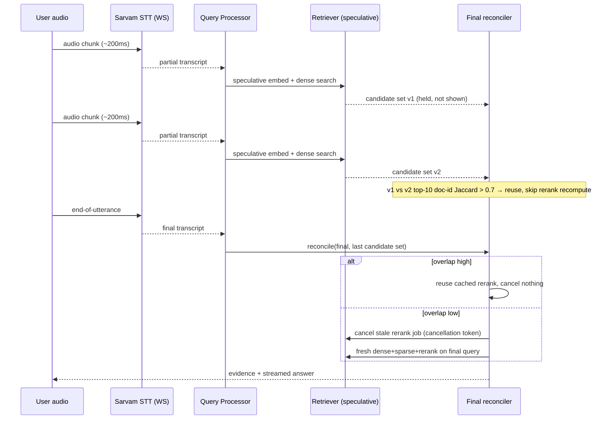

# Architecture & Retrieval

## System architecture

Two lanes run at different speeds: a **fast lane** (STT → query understanding
→ hybrid retrieval → fusion → rerank → evidence) engineered against the
200ms budget, and a **generation lane** (context build → LLM → grounding →
guardrails) that is deliberately streamed rather than budgeted into the same
window.

The dotted edges are non-blocking: caching and observability instrument the
path without sitting on it, and provenance anchoring happens at index-build
time, never inside a request.

## Chunking strategy

Given the [dataset analysis](01-dataset-analysis.md) finding that MSMARCO-XI
passages are already short, pre-segmented units (median length well under
512 tokens, matching the original MS MARCO's ~55-word passage average), a
single aggressive fixed-size splitter would be actively harmful — it would
fragment atomic passages that are already the right retrieval granularity.
The chunking layer is instead a small decision pipeline:

| Strategy | Role here |
|---|---|
| **A — Fixed-token (fallback only)** | Applied only to the <2% of passages that exceed 512 tokens (long "description"-type answers). 256-token windows, 64-token overlap. Not the default path. |
| **B — Sentence-aware (default)** | Passages under the token ceiling are kept whole; if a split is forced, it breaks on sentence boundaries using a multilingual sentence splitter (IndicNLP / syntok fallback for scripts without reliable punctuation cues, e.g. some Sanskrit text). |
| **C — Semantic chunking** | Reserved for the future long-document deployment path, where passage boundaries don't exist. Uses BGE-M3 embedding-similarity dips between consecutive sentence windows to place cut points. Not exercised on MSMARCO-XI itself. |
| **D — Metadata-aware** | Every chunk is tagged with `language`, `query_id` (provenance to the source query context), `is_selected` (when available, for eval-only indices), and `source=eng\|translated` — enabling per-language and per-source filtered retrieval. |
| **E — Hierarchical** | Document→section→passage→sentence is implemented as a schema capability in the vector payload (`parent_id`, `level`) but is a no-op on this dataset. Activates automatically once ingested documents carry structure. |
| **F — Query-aware granularity** | The real lever for this dataset — see decision below. |

### Decision: query-aware retrieval granularity

- **Problem:** Retrieval granularity fixed at index time can't match both
  broad ("what is diabetes") and narrow ("ICD-10 code for type 2 diabetes")
  queries well.
- **Options:** (1) Always retrieve single passages. (2) Always retrieve
  passage + neighbor concatenation. (3) Query-length/entity-density-adaptive
  granularity.
- **Trade-offs:** Option 2 wastes context tokens on narrow queries and
  dilutes reranker precision; Option 1 under-serves broad queries that need
  synthesis across passages.
- **Decision:** classify the query as narrow / broad / ambiguous using a
  cheap deterministic signal (token count + named-entity count from a fast
  NER tagger, <3ms) before retrieval. Narrow → retrieve top-5 single
  passages. Broad → retrieve top-10 passages and let the context builder
  merge same-topic passages (near-duplicate clusters via cosine > 0.92).
  Ambiguous → retrieve at both settings in parallel (cheap, since both hit
  the same warm Qdrant collection) and let the reranker's score spread pick
  the winner.
- **Reason:** this is a lookup table, not a model call — it stays inside the
  latency budget while still adapting retrieval shape to query intent.

## Retrieval architecture

### Decision: single-encoder hybrid retrieval

- **Problem:** Need dense + sparse retrieval across 14 languages without
  running two full model-serving stacks in the hot path.
- **Options:** (A) Separate dense encoder + standalone SPLADE service +
  Elasticsearch/OpenSearch. (B) BGE-M3 (dense + learned-sparse +
  ColBERT-style multi-vector, one model) + embedded BM25.
- **Trade-offs:** (A) is the "textbook" hybrid stack but doubles GPU serving,
  doubles p99 tail risk, and needs a second index technology to operate.
  (B) collapses two of three signals into one encoder call, at the cost of
  being locked to BGE-M3's sparse vocabulary rather than a purpose-built
  SPLADE.
- **Decision:** BGE-M3 as the single dense+sparse encoder, its output written
  into **one** Qdrant collection with named vectors (`dense`, `sparse`). A
  separate embedded **Tantivy BM25** index (in-process, sub-millisecond, no
  server) runs alongside as a third, model-independent signal — it's what
  catches exact IDs, numbers, and proper nouns that any embedding-based
  sparse representation can under-weight.
- **Reason:** one fewer service to keep warm and healthy, and BM25-via-Tantivy
  is nearly free to add for the robustness it buys.

### Fusion

Candidates from Qdrant's native dense+sparse hybrid query and the Tantivy
BM25 lookup are merged with **Reciprocal Rank Fusion**
(`score = Σ 1/(k + rank_i)`, `k=60`). RRF is chosen over weighted score
fusion because dense cosine, BGE-M3 sparse scores, and BM25 scores live on
incompatible scales — RRF only needs rank order, so it needs no per-language
score calibration, which matters across 14 languages with different score
distributions. A learned fusion model (logistic regression over the three
rank signals, trained on the `is_selected` labels) is proposed as an
[experiment](08-repo-and-stack.md#experiment-matrix), not the initial
default — it adds a training/maintenance surface that RRF avoids.

### ANN index

Qdrant HNSW, `m=16`, `ef_construct=128`, `ef_search` tuned per collection
size (start 64, raise if recall@10 on the eval set drops below target).
Payload-indexed on `language` so per-language filtered search doesn't do a
full scan.

## Reranking

| Parameter | Value | Why |
|---|---|---|
| Candidate count in | 20 (top-10 dense + top-10 sparse/BM25, deduped post-fusion) | Beyond ~20–30, cross-encoder marginal accuracy gain flattens while latency grows linearly. |
| Model | `bge-reranker-v2-m3`, INT8 quantized, ONNX runtime | Multilingual cross-encoder covering all 14 target languages; small enough to batch-score 20 pairs in one forward pass on CPU/GPU. |
| Reranked count out | Top-5 (narrow query) / top-8 (broad query) | Matches the context-builder's token budget for the generation stage. |
| Latency | ~15–25ms batched on a warm GPU worker (T4/L4 class); ~60–90ms CPU fallback | Fits inside the 200ms retrieval budget only on GPU — CPU fallback is a degraded-mode path, not the default. |
| Fallback behavior | If reranker times out or the worker pool is saturated, serve RRF-fused order directly with a `reranked=false` flag in the trace. | Never blocks the response on the reranker; degrades gracefully rather than failing the request. |

LLM-based reranking (listwise, using the answer-generation model to reorder
candidates) is explicitly **excluded from the hot path** — a single LLM call
to score 20 candidates costs hundreds of milliseconds, incompatible with the
latency budget. It's retained only as an offline evaluation tool to
sanity-check the cross-encoder's ordering on a sample.

## Query understanding layer

Deterministic by default; a model is invoked only when a specific, named
condition fires. This keeps a large LLM out of the critical path.

Two of the three triggers fire *after* a first retrieval attempt has already
happened — rewriting is treated as a recovery/refinement step layered onto a
fast default path, not a gate every query must pass through. This mirrors
the streaming reconciliation logic below.

## STT selection

### Decision: Sarvam over ElevenLabs

- **Problem:** Need streaming STT across 14 Indic languages with native
  Hindi/regional-language ↔ English code-switching and low
  time-to-first-token.
- **Options:** Sarvam (Saaras v3) vs. ElevenLabs (Scribe v2 Realtime).
- **Trade-offs:** ElevenLabs Scribe v2 Realtime advertises ~150ms latency and
  93.5% accuracy across 30 languages — strong engineering, but Indic
  languages and code-switching are a subset of a broad multilingual mandate,
  not the design center. Sarvam's Saaras v3 is trained specifically on 1M+
  hours of real Indian audio through a code-mixing-aware pipeline, and
  quotes sub-150ms time-to-first-token over WebSocket with 4 streaming
  modes.
- **Decision:** Sarvam.
- **Reason:** MSMARCO-XI's population is exactly the population Sarvam was
  built for — Hindi/English and regional-language/English code-mixing,
  Indian accents, telephony-grade noise. A specialist model matched to the
  exact language distribution of the corpus beats a strong generalist at
  the same latency tier. ElevenLabs is kept as a documented fallback
  provider (interface-compatible adapter) for languages or accounts where
  Sarvam coverage or reliability gaps appear.

| | Sarvam Saaras v3 | ElevenLabs Scribe v2 Realtime |
|---|---|---|
| Indic specialization | Purpose-built, 1M+ hrs Indian audio | General multilingual (30 languages) |
| Code-switching | Native, trained-in | Not a stated design focus |
| Streaming TTFT | <150ms (WebSocket, 4 modes) | ~150ms end-to-end (excl. network/app) |
| Confidence scores | Per-segment, exposed via API | Exposed via API |
| SDKs | Official Python/Node | Official Python/Node/JS |

Sources: [Sarvam streaming STT docs](https://docs.sarvam.ai/api-reference-docs/api-guides-tutorials/speech-to-text/streaming-api), [Sarvam STT](https://www.sarvam.ai/speech-to-text), [ElevenLabs Realtime STT](https://elevenlabs.io/realtime-speech-to-text-api), [ElevenLabs India](https://elevenlabs.io/india).

## Streaming architecture

The differentiator: retrieval starts on partial transcripts, and the final
transcript *reconciles* against speculative work instead of discarding it.

- **Debounce:** a partial only triggers speculative retrieval if it has been
  stable (edit distance below threshold vs. the previous partial) for one
  consecutive frame — avoids re-embedding on every single-word delta.
- **Cancellation:** every speculative job carries a request-scoped
  cancellation token; a fresh partial or the final transcript cancels any
  in-flight rerank that it invalidates, so GPU workers aren't wasted
  finishing stale work.
- **Reconciliation:** compare top-10 document-ID sets (Jaccard) between the
  last speculative pass and a fresh embed of the final transcript. High
  overlap → serve the cached, already-reranked result with near-zero added
  latency. Low overlap (user changed their question mid-utterance) → discard
  and run fresh, same as a cold request.
- **Honesty check:** this only shrinks *perceived* latency for utterances
  where the query is decided early. A short, front-loaded correction
  ("...actually, not diabetes, hypertension") is the case reconciliation
  exists for, and it pays the full retrieval cost.
