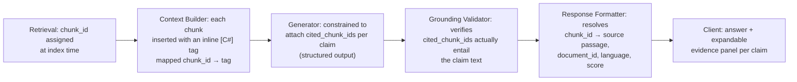

# Harness & Guardrails

## LLM harness / orchestration

A typed pipeline, not a prompt-in-response-out call. Every stage takes and
returns a validated schema (Pydantic), carries the request's `trace_id`, and
has an explicit timeout + fallback.

```python
class RetrievalCandidate(BaseModel):
    chunk_id: str
    doc_id: str
    language: str
    text: str
    dense_score: float
    sparse_score: float
    rerank_score: float | None
    is_selected_eval: bool | None      # present only on eval-indexed data

class GenerationRequest(BaseModel):
    trace_id: str
    query_final: str
    query_language: str
    candidates: list[RetrievalCandidate]
    retrieval_confidence: float        # top-1 rerank_score, drives the guardrail
    mode: Literal["extractive", "generative"]

class Claim(BaseModel):
    text: str
    cited_chunk_ids: list[str]
    entailment_score: float            # from the grounding validator

class AnswerResponse(BaseModel):
    trace_id: str
    answer_text: str
    claims: list[Claim]
    confidence: float
    guardrail_flags: list[str]
    pipeline_version: str
    model_version: str
    latency_ms: dict[str, float]       # per-stage breakdown
```

Orchestration properties, concretely:

- **Router, not always-LLM:** when `retrieval_confidence` is high and the top
  passage's `is_selected`-style match is near-exact, the harness takes the
  `extractive` path — return the top passage (trimmed, cited) with template
  phrasing, skipping the generative model entirely. Below that threshold,
  the `generative` path runs the LLM. This is a latency *and*
  hallucination-risk control, not just a speed hack — an extractive answer
  cannot hallucinate.
- **Timeouts + circuit breaker:** each external call (STT, reranker worker,
  LLM) has a hard timeout; three consecutive timeouts on a dependency open a
  circuit breaker that routes to a fallback (secondary STT provider, smaller
  local LLM, or a "reduced confidence" extractive answer) for a cooldown
  window.
- **Retries:** idempotent stages (embedding, retrieval) get one bounded
  retry with jitter; the generation stage does not auto-retry on a partial
  stream — a truncated generation is treated as a failure and surfaced, not
  silently regenerated (avoids double-billing an LLM call and duplicate
  side effects).
- **Structured output:** the generator is constrained to emit the
  `AnswerResponse` JSON shape via grammar-constrained decoding (e.g.,
  outlines/JSON-schema mode), not parsed out of free text — removes an
  entire class of "LLM forgot to cite" failures.
- **Request IDs + cancellation:** one `trace_id` per user turn, propagated
  through every stage and into OpenTelemetry spans; a client disconnect
  propagates a cancellation signal that aborts in-flight retrieval/generation
  jobs rather than letting them run to a discarded result.

## Guardrails & grounding

| Guardrail | Design |
|---|---|
| **Off-topic detection** | Corpus topic centroid computed offline from a sample of indexed embeddings. If the query embedding's max similarity to any cluster centroid falls under threshold *and* top-1 rerank score is low, return the fixed refusal: "I couldn't find enough information in the available knowledge base to answer that reliably." No LLM call spent on a query the retriever already signaled is out of scope. |
| **Unsafe / inappropriate input** | Small moderation classifier (multilingual, distilled) runs on the transcript before retrieval and on the generated answer before it ships — input and output are both checked, since retrieved chunks are untrusted content. |
| **Hallucination / grounding** | Every generated sentence is split into claims; each claim is checked against its cited chunk(s) with a multilingual NLI cross-encoder (entailment vs. neutral vs. contradiction). A claim scoring below the entailment threshold is either dropped and the answer regenerated once with a stricter "only state what's in the passages" instruction, or — on a second failure — removed with a visible "unverified" marker rather than shipped silently. |
| **Low retrieval confidence** | `retrieval_confidence < τ` (top rerank score) short-circuits straight to the "not enough information" response before the generator is even invoked — same gate as off-topic detection but triggered by score rather than topic distance. |
| **Conflicting sources** | If the top-K reranked passages have high mutual dissimilarity in stance (checked via the same NLI model, contradiction class between passage pairs) alongside comparable relevance scores, the answer generator is instructed to surface both positions explicitly with separate citations rather than silently picking one — "sources disagree" becomes part of the answer, not noise the model averages away. |
| **Prompt injection in retrieved text** | See [Web3 & Privacy](05-web3-and-privacy.md#security) — retrieved passages are wrapped in an explicit untrusted-data delimiter and the system prompt states that instructions inside retrieved content are never followed. |

## Citation / evidence system

Citations are carried as first-class data through every stage, not
reconstructed after the fact by string-matching the answer against the
context:



The client-facing response exposes `claims[].cited_chunk_ids` resolved to
full passage text and score, via `GET /v1/evidence/{id}` — a user can
inspect exactly which passage backs any sentence in the answer, and the
grounding validator's entailment score travels with it as a per-claim
confidence rather than one opaque number for the whole answer.
