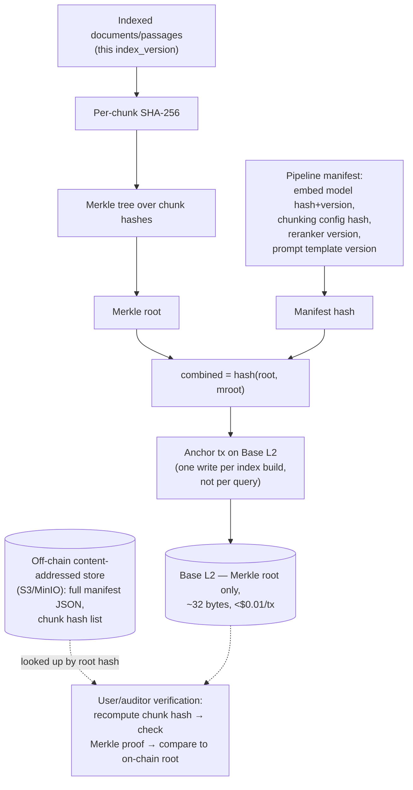

# Web3 & Privacy

## Web3 integration — where it actually helps

> **What it's for:** exactly one job — a **tamper-evident, publicly
> verifiable commitment to which corpus + pipeline configuration produced
> the index a user is querying against**. Not per-answer logging, not access
> control, not a token.

A user or auditor can verify "this exact passage was part of the indexed
knowledge base at version N" by recomputing the chunk's hash, walking a
Merkle proof to the root, and comparing that root against the on-chain
commitment — without the chain ever having stored the passage itself.
Anchoring happens **once per index build/version** (on the order of
daily-to-weekly, whenever the corpus or pipeline config changes), amortizing
gas cost to effectively nothing.

### Decision: anchor chain

- **Problem:** Which chain to anchor Merkle roots on.
- **Options:** Base, Polygon PoS, Linea.
- **Trade-offs:** Base and Linea both post under ~$0.01/tx post-Dencun blob
  pricing; Polygon PoS sits in a higher $0.05–$0.50 tier and is a separate
  validator-set chain rather than an Ethereum L2, a weaker
  trust-inheritance story for a provenance use case. Base has materially
  deeper tooling/RPC-provider maturity than Linea at time of writing.
- **Decision:** Base.
- **Reason:** cheapest practical tier, inherits Ethereum L1 security via the
  OP Stack, and has the most mature developer tooling (Foundry, Viem) for a
  small team to integrate without becoming a blockchain-ops specialty. A
  single-purpose contract exposing
  `anchor(bytes32 root, bytes32 manifestHash, uint256 indexVersion)` plus a
  public getter is the entire on-chain surface — no upgradability proxy, no
  admin key beyond a rotation-capable multisig for the anchoring account.

### Explicitly out of scope — and why

| Do NOT use Web3 for... | Because... |
|---|---|
| Per-query on-chain writes | A chain write per user turn would add hundreds of milliseconds to seconds of confirmation latency to a budget already tight at 200ms, and would cost real money per query for zero retrieval-quality benefit. |
| Vectors/embeddings/documents on-chain | Storage cost for even one embedding (thousands of floats) dwarfs a 32-byte hash by orders of magnitude, and the data has no reason to be public or immutable at that granularity. |
| Voice, transcripts, or any user PII | A public chain is a permanent, globally-readable log — the opposite of what user privacy requires. |
| Decentralized inference / decentralized vector DB / a token | None of these solve a problem this system actually has; they add operational and regulatory surface (key management, token economics, gas volatility) for no measurable gain in retrieval quality, latency, or trust for this use case. |

Per-answer provenance is implemented, but **off-chain**: each response can
optionally carry a signed manifest (query hash, cited chunk_ids,
index_version, model/pipeline version, timestamp, confidence) stored in the
provenance database and signed with a service key. If audit requirements
ever demand chain-level tamper evidence for answers specifically, the
correct mechanism is *batching* — build a daily Merkle tree over that day's
answer-manifest hashes and anchor one root, not one transaction per answer.

## Privacy model

| Data | Handling |
|---|---|
| Raw audio | Buffered in memory / short-lived object storage for the duration of the STT stream only; not persisted after transcript finalization unless the user explicitly opts into "save my query audio" for support purposes (separate consent, separate retention policy). |
| Transcripts | Stored encrypted at rest (AES-256), tied to a session, default retention 30 days, purgeable on user request. |
| Query embeddings | Cached with a short TTL; not retained in the permanent provenance store — provenance concerns the corpus, not the user's queries. |
| Logs | Structured JSON logs strip transcript/answer text by default in production tiers above debug; trace IDs, timings, scores, and flags are retained without raw content. |
| Blockchain | Receives **zero** user data — only Merkle roots over the corpus and pipeline manifest hashes, computed independently of any user request. |

## Security

- **Prompt injection / indirect injection:** retrieved passages are wrapped
  in an explicit untrusted-content delimiter in the prompt (e.g.
  `<retrieved_context untrusted="true">`), and the system instruction states
  plainly that content inside that block is data to cite, never instructions
  to follow. The grounding validator additionally checks the generated
  answer for verbatim leakage of suspicious strings (URLs, imperative
  phrasing) sourced from a single low-confidence chunk.
- **API abuse / replay:** per-key rate limiting at the gateway, request
  signing with a timestamp + nonce to reject replayed requests, and
  oversized-input rejection (max audio duration, max query length) before
  any model is invoked.
- **Malformed audio:** magic-byte/format validation and a duration/size cap
  at the gateway before the STT provider ever sees the bytes.
- **Data exfiltration via the answer:** the answer generator only ever sees
  retrieved chunks and the query — it has no tool access to external
  systems, so there's no channel for a malicious retrieved document to make
  it call out anywhere.
