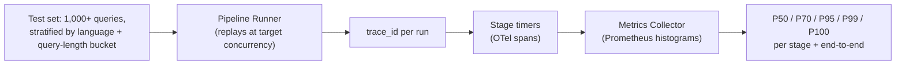

# Observability, Evaluation & Reliability

## Observability

Every request carries one `trace_id` through OpenTelemetry spans:
`voice_ingestion → stt → query_processing → embedding → dense_retrieval →
sparse_retrieval → fusion → reranking → generation → grounding → guardrails
→ response`.

Prometheus collects per-stage latency histograms (for the P50/P70/P95/P99
rollups below), cache hit/miss counters, retrieval confidence distributions,
per-language error rates, and token usage. Grafana dashboards split by
**language** as a first-class dimension — a global P95 can hide a specific
language (e.g. Sanskrit, likely the lowest-resource of the 14) silently
performing far worse. Structured JSON logs carry `trace_id`, stage timings,
and version fields but not raw transcript/answer content by default (see
[Privacy model](05-web3-and-privacy.md#privacy-model)).

## Evaluation framework

| Category | Metrics | Test set |
|---|---|---|
| Retrieval | Recall@10, MRR@10 (the standard MS MARCO passage-ranking metric), NDCG@10, Hit Rate@5 | `is_selected` from the validation split, stratified 500–1,000 queries/language × 14 languages ≈ 7,000–14,000 queries — large enough for stable per-language MRR, matching MS MARCO's own dev-set evaluation convention. |
| RAG | Faithfulness (entailment-based), answer relevance, context relevance, citation accuracy, groundedness | LLM-judged subset, ~300/language stratified ≈ 4,200 — smaller because judging is the expensive step. |
| Speech | WER, CER, language-ID accuracy, code-switch segment accuracy | Held-out synthesized/recorded speech per language; WER tracked separately for clean vs. noisy audio. |
| System | P50 / P70 / P95 / P99 / P100 latency, per stage and end-to-end | See benchmark methodology below. |

## Latency benchmark harness

Recommended methodology: replay ≥1,000 queries per condition, minimum 100
per (language × narrow/broad/ambiguous) cell to keep tail percentiles
meaningful. Measure four conditions separately rather than blending them —
**cold start** (first request after deploy, no warm cache/model), **warm
start** (steady state, empty cache), **cache hit**, and **cache miss** —
plus a concurrency sweep (1, 10, 50, 200 concurrent streams) since
reranker-worker saturation is the most likely source of tail-latency
blowup under load.

**P100 is explicitly called out as noisy** — it's one sample, dominated by
whatever single outlier (a GC pause, a cold cache) happened to occur;
report it, but track P99.9 alongside it and separate true timeouts/errors
into an error-rate metric rather than letting them distort the latency
percentile.

## Failure injection

| Injected fault | Expected graceful behavior |
|---|---|
| STT timeout | Circuit breaker opens after 3 consecutive timeouts → fallback provider (ElevenLabs adapter) or a clear client-facing "voice service unavailable, try text" error. |
| Vector DB unavailable | Fall back to BM25-only (Tantivy) retrieval with a `degraded=true` flag; never fail the whole request if a partial signal is available. |
| Embedding service failure | Serve from embedding cache if present; else fall back to BM25-only, same as above. |
| LLM timeout | Fall back to the extractive path — the top reranked passage, cited, with a "generation unavailable" flag rather than an empty response. |
| Malformed model output | Schema validation rejects it; one bounded retry with a stricter format instruction; second failure falls back to extractive. |
| Low retrieval confidence | Explicit "not enough information" response, no generation attempted. |
| Conflicting documents | Surfaced explicitly in the answer, not silently resolved. |
| Malicious prompt / injected instruction in a retrieved chunk | Untrusted-content delimiter + output-side leakage check. |
| Empty query | 400 with a clear message; no downstream stage invoked. |
| Extremely long query | Truncated at the gateway with a visible truncation notice before it reaches the embedder. |
